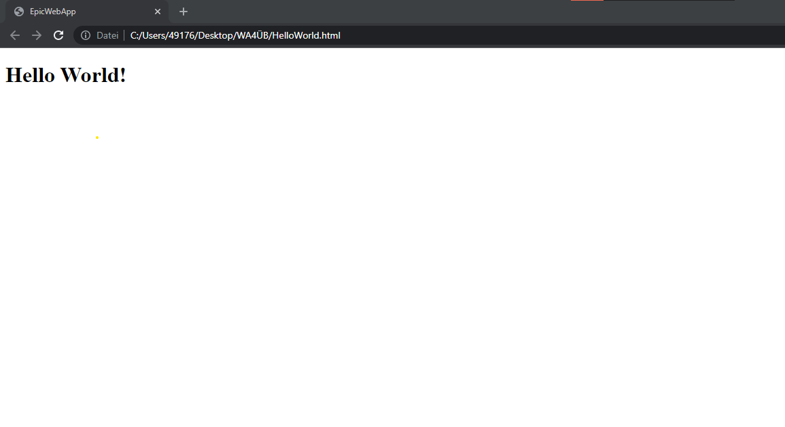

# EpicHelloWorld

This project is a Web based HelloWorld programm. It´s written in Html and shows the basic usage of Html-tags. As well as the structure of the head and body component in Html.

## Requirments:

A working Webbrowser on your Pc or Laptop.

## Installation:

Download the Html-file right click it and select open with for example Chrome.
Or pull the file into your browser window.
